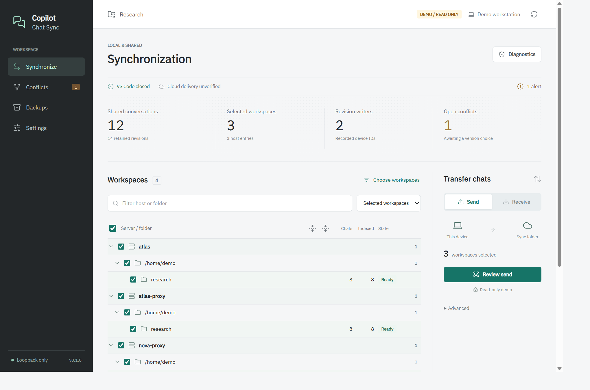
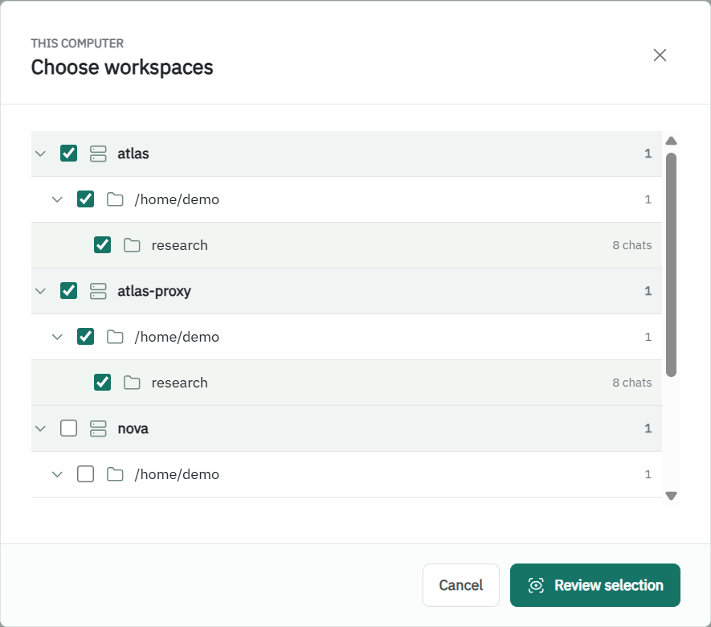
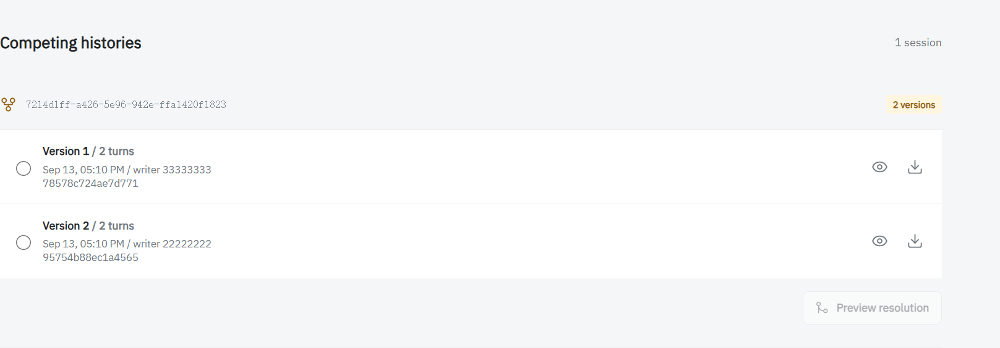

# Copilot Chat Sync

Move **legacy VS Code Copilot chats** between computers through OneDrive or another
synced folder. A local browser panel handles setup, transfers, conflicts and backups.

**Run it on each desktop computer, not your SSH servers.**

> Early preview, unofficial. Real Windows/OneDrive handoff
> and native Copilot continuation still need a pilot. Not for Agent Host or CLI sessions.



## Start

**Windows 10/11 x64: no Python installation required.**

1. Open [Releases](https://github.com/ziao-liu/copilot_chat_sync/releases/tag/v0.1.0)
  and download `CopilotChatSync-0.1.0-windows-x64-Setup.exe`.
2. Install for your user, then open **Copilot Chat Sync** from the Start menu.
3. Your browser opens the local panel. Keep its console window running; `Ctrl+C` stops it.

Prefer no installer? Download the portable ZIP, extract the **whole folder**, and
open `CopilotChatSync.exe`. Keep `_internal` beside it. The binaries are unsigned;
Windows may show a SmartScreen warning. Release assets include SHA256 checksums.

<details>
<summary>Source install (Python 3.10+, Linux/macOS or development)</summary>

Use a local external terminal on each computer:

```powershell
git clone https://github.com/ziao-liu/copilot_chat_sync.git
cd copilot_chat_sync
python -m pip install .
python -m copilot_chat_sync panel
```

Your browser opens automatically. Keep this terminal running; `Ctrl+C` stops the panel.
For later launches, only the last command is needed.

</details>

## Set Up Once

1. Check the detected OneDrive folder and local VS Code data location.
   Use **Change locations** only when needed.
2. Click **Continue**, then choose workspaces in the server/folder tree.
   Missing project? Open it once in desktop VS Code, then **Scan again**.
3. Click **Review setup**, close VS Code, and **Confirm & apply**.



Repeat on the other computer using the **same cloud folder** and its own local workspaces.
The local data folder on standard Windows VS Code is `%APPDATA%\Code\User\workspaceStorage`.

> **One shared folder = one chat pool.** Receive imports that pool into every selected
> workspace. The directory tree is visual grouping, not per-project isolation.
> Use [separate groups](docs/advanced.md#separate-groups) for unrelated projects.

## Switch Computers

1. **Computer A:** close VS Code, select **Send**, review and confirm.
2. Wait for OneDrive to finish uploading and downloading on **both computers**.
3. **Computer B:** keep VS Code closed, send any existing local changes first,
   resolve conflicts if needed, then **Receive**. Reopen VS Code afterward.

Send/Receive works on the local sync folder; success does not confirm cloud delivery.
Conflicting versions are kept for review, not silently overwritten or combined.



## Before Your First Sync

- Back up your chats and project code. Test with one non-editing conversation first.
- Stop old sync/link scripts on **every computer**. For old directory links, use
  **Review old setup**; use a new tool folder, not the old raw chat folder.
- Editing-snapshot quarantine needs explicit confirmation and removes access to old
  undo/checkpoints. This tool does not sync project code or live editing state.
- Keep the shared folder private. Chats/backups are not encrypted by this tool;
  do not share the panel's private URL.

## More

From the portable folder, preview without touching your chats:

```powershell
.\CopilotChatSync.exe panel --demo
```

To update, close the app and install/extract the new release. Uninstalling keeps
your chats, shared store and local configuration/backups.

[Migration, recovery, CLI and limitations](docs/advanced.md).
All screenshots use synthetic demo data. [MIT license](LICENSE).